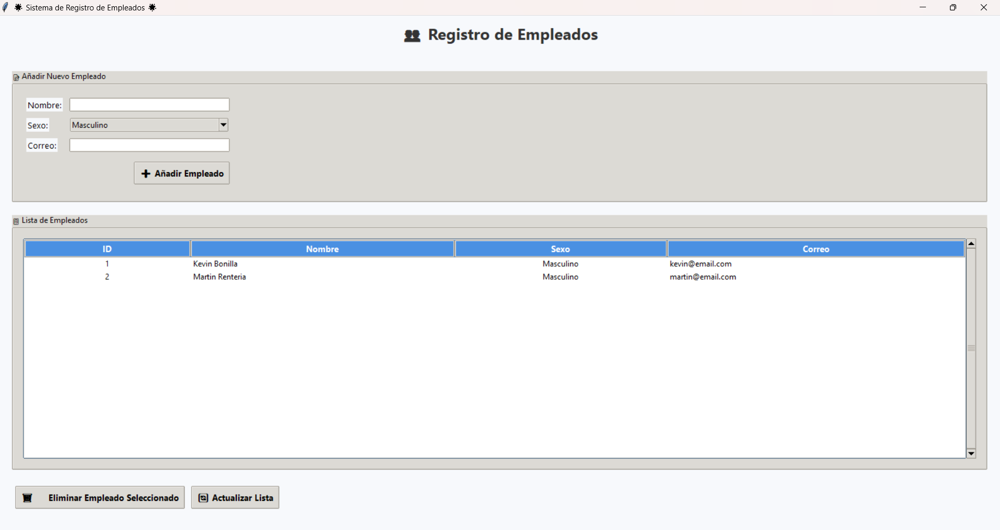

# 🌟 **Sistema de Registro de Empleados con Tkinter y MySQL**

> 🐍 Aplicación de escritorio desarrollada en **Python** con una interfaz moderna hecha en **Tkinter** y conexión a **MySQL** para la gestión de empleados.

---

## 🎯 **Objetivo**

Este sistema permite **registrar, listar y eliminar empleados** de forma intuitiva, con una interfaz visualmente agradable y colores personalizables.  
Ideal para prácticas de **POO, bases de datos y GUI en Python.**

---

## 🧩 **Características**

✨ Interfaz moderna y colorida con `ttk.Style`  
🔒 Conexión segura con **MySQL** mediante `mysql.connector`  
🧾 Registro de empleados con los campos:
- 🧍‍♂️ **Nombre**
- 🚻 **Sexo**
- 📧 **Correo electrónico**
📊 Visualización en tabla interactiva (`Treeview`)  
🧹 Funciones para **añadir, eliminar y actualizar** empleados  
🧱 Creación automática de la tabla `empleados` si no existe  

---

## 🖼️ **Interfaz Visual**

Vista previa de la aplicación:  



> 🎨 La interfaz usa una paleta suave y moderna con íconos y emojis para una mejor experiencia de usuario.

---

## ⚙️ **Requisitos**

📦 **Python 3.10+**

Instala el conector MySQL con:

```bash
pip install mysql-connector-python
```

---

## 🗃️ **Configuración de la Base de Datos**

1️⃣ Crea la base de datos:

```sql
CREATE DATABASE empresa_db;
```

2️⃣ Edita las credenciales en `app.py`:

```python
DB_HOST = "localhost"
DB_USER = "root"
DB_PASSWORD = "toor"  # 🔐 Cambia por tu contraseña
DB_NAME = "empresa_db"
```

> 🧠 La tabla `empleados` se genera automáticamente al iniciar la app.

---

## 🚀 **Ejecución**

Ejecuta el programa desde la terminal:

```bash
python app.py
```

> 💡 Al iniciar, verás una ventana con la interfaz lista para usar.

---

## 📂 **Estructura del Proyecto**

```plaintext
📦 EJERCICIO-13/
 ┣ 📂 fotos/
 ┃ ┗ 🖼️ interfaz.png
 ┣ 📜 app.py
 ┣ 📜 README.md
```

---

## 🧠 **Aprendizaje Clave**

Este proyecto integra los siguientes conceptos:

| 🧩 Área | 💡 Concepto aplicado |
|:--|:--|
| ⚙️ Programación | Programación Orientada a Objetos (POO) |
| 💾 Bases de Datos | Conexión y consultas MySQL |
| 🎨 Interfaz | Tkinter con estilos y temas |
| 🚨 Control de errores | Manejo de excepciones y validaciones |

---

## 👨‍💻 **Autor**

**Kevin Bonilla**  
📚 Proyecto educativo realizado con fines de práctica y aprendizaje.  
💬 *“Aprender creando es la mejor forma de entender la programación.”*

---

## 🛠️ **Licencia**

🆓 Este proyecto es **libre para uso educativo o personal.**  
Se agradece mantener el crédito al autor. 🙌

---

## 💖 **Agradecimientos**

- 🐍 Python por su simplicidad.  
- 🖥️ Tkinter por su flexibilidad.  
- 💾 MySQL por su robustez.  
- ✨ Y a ti, por revisar este proyecto.

---
